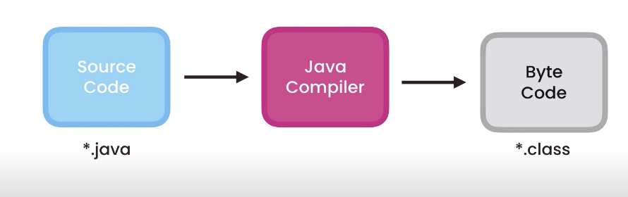
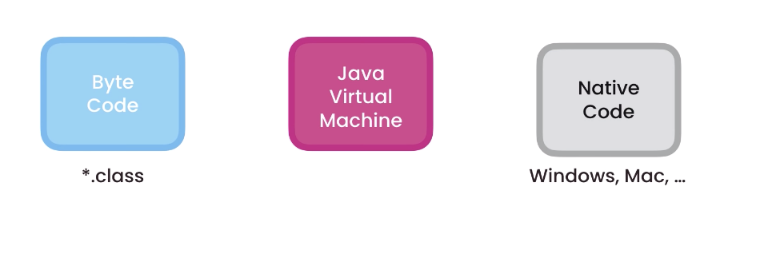
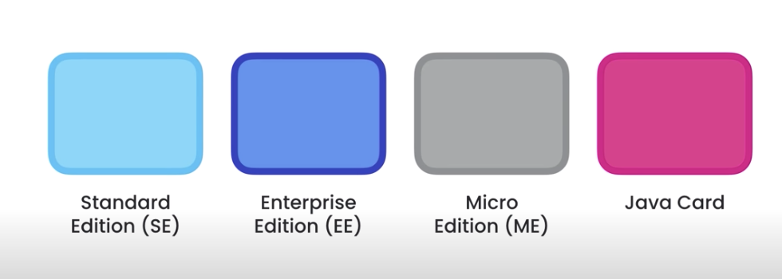
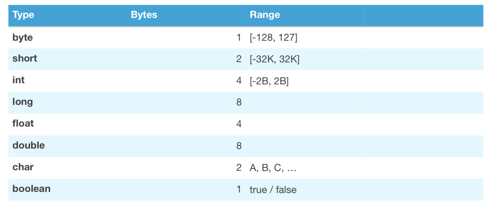

# Java_Functions and Programming 
 This repo documents different Java functions and data streaming using Java.

 Java language is a basic English words but in a very specific way that computers can understand and it offers a huge library of instructions and commands that you could just use straight away. 

 **example**
 `System.out.println();`

 This command here instructs the computer to display something on the screen like a `text message` or `result of a calculation` or `a decision that the computer just made`. It prints anything that you have written within the parenthesis.

 `System.out.println("Hello, World");`

## Important 
- It is important to know that Javs is case sensitive. For example in the command line above, `System` starts with capital letter and `out` with small letter.
- Quotation marks display the message as in "Hello, World"
- Finally the semi-colon means end of statement and anything else after that is the begining of a new statement. But before we start, we are going to download and install the neccessary tools to build Java applications.

# Setup and Dependencies
- Download and install `jdk` (java development kit) version 12.0.1 upwards
- Next we will install a code editor. There are many java code editors for building java applications. The popular ones are `NetBeans`, `Eclipse` and `IntelliJ`. For this project I will be using `IntelliJ`.

- Install `IntelliJ` code editor 

# Anatomy of a Java Program

- **Functions:** The smallest building block in Java application is `function`. A functuion is a block of code that performs a task.

- **Class:** A class is a container for related functions.
- **Methods:** A method is a function that is part of class. We can have a function that exist outside of a class, in this case we call it `function`. But when a function is part of a class it we refer it as a `method of that class`.

- In java all these `class and methods` should have an access modifier. An `access modifier` is a special key word that determines if other classes and methods in this programm can access other class and methods. We have various access modifiers like `public`, `private` and so on. Most of the time we use the `public modifier` so we put that before the class. 

## Java Compiler 

- **Download and Install Java Runtime Environemnt (JRE)** which allows the package to run on any environment. **Download** from `www.java.com/download`. This contains `Java Virtual Machine` (JVM).

The JVM takes our Java Byte Code and translate it to the Native Code in the operating system. This application is why java applications are independent. 

# Java Editions 

We have Four editions of java for building different kinds of applications:
- Standard Edition (SE): which contains all libraries that every java developer must learn 
- Enterprise Edition (EE): which is used for building last scale and distributed systems built on top of java standard edition.
- Micro Edition (ME): which is subset of java standard edition designed for mobile devices. So it has libraries specific for mobile devices 
- Java Card: which is used in smart cards. 

## Variables 
- We use variables to temporarily store data in computer memory.

## Types 
- **Primitive:** for storing simple values. The more bytes we have the more values that we can store. If we want to stor a number that have decimal places in them, we have to use float or double.

- **Reference:** for storing complex objects like `date` and `mail messages`.
**Note when dealing with reference, we should always allocate a `memory`**. Also reference types have `Objects` which are not included in the primitive type.

- An object is an instance of a class. An object have members of a class that we can access using the `dot` operator.

## Code snipet 

`sout` tab: gives `System.out.println();`

## Memory Management for Primitive and Reference Types 

You need to remeber that:
- Reference type are copied by their reference 
- Primitive types are copied by their value and these values are completely independent of each other.

## Arrays 
we use arrays to store a list. 
- Remember, array have a fixed length in java.

## Multi-dimensional Arrays
- we can create a two-dimensional arrays to store a matrix or three-dimensional to store data of a queue.
- These are useful in Scientific computations

